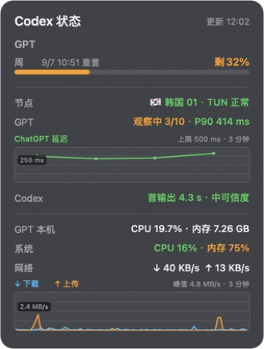

# AI Tools

个人使用的轻量 AI 工具集合。

## 应用截图



截图为实际运行示例，数值随使用情况变化。

## Tools

| 工具 | 说明 |
|---|---|
| [Codex 状态](tools/codex-status/README.md) | macOS 桌面状态卡片：Codex 额度、连接诊断、TUN/代理、系统资源和滚动趋势图 |

## 安装 Codex 状态

适用于 Apple Silicon Mac。推荐把下面这段话直接发给 Codex：

```text
请从 https://github.com/liyatang/ai 安装 tools/codex-status。
先只读检查我的 Mac 是否为 Apple Silicon、Python 3 是否满足要求，以及 Codex 是否已登录。
不要读取或输出 auth.json 的内容。
如果缺少 Python，请先说明安装方式并等我确认；然后按照 AGENTS.md 运行 install.sh，验证 App 签名、进程和窗口。
不要自动添加开机登录项。
```

也可以手动执行：

```bash
git clone https://github.com/liyatang/ai.git
cd ai/tools/codex-status
./install.sh
```

要求：

- Apple Silicon Mac（M 系列芯片）
- Python 3.9 或更高版本；没有时让 Codex 在征得确认后协助安装
- 已登录 Codex；额度读取使用安装者自己的登录态

安装包内已包含 arm64 预编译 App，不要求安装 Xcode。首次打开、更新、隐私和卸载说明见 [完整文档](tools/codex-status/README.md)。
