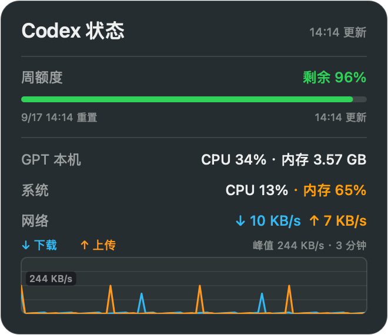

# Codex 状态

面向 Apple Silicon Mac 的轻量桌面状态卡片，固定显示在主屏幕左上角。



截图为新版界面的合成验收示例；实际数值随使用情况变化。

它显示：

- 周额度、重置时间、额度独立更新时间；未知额度不显示为剩余 100%，失败回退标记缓存，跨重置点失效。
- GPT 本机、系统 CPU/内存和三分钟上下行趋势。GPT 本机仍按明确程序路径识别 ChatGPT/Codex 应用及专用 Computer Use/Chrome 助手，每个 PID 只计一次；排除普通浏览器、项目 Node、Docker 和状态小组件。CPU 为单核 100% 的进程口径，内存采用 `ri_phys_footprint`，按十进制 GB 显示；读取失败不回退为 RSS。

面板已移除连接诊断、节点建议和 ChatGPT 延迟图，同时停止后台重试日志采集、DNS 检查与节点测速。历史诊断脚本保留在源码中，桌面 App 不再调用。

## 安装或更新（推荐）

**支持 M 系列 Mac，macOS 14 或更新版本。无需安装 Xcode 或自己编译。**

复制下面这句话给 Codex，首次安装和更新都可以：

```text
请帮我安装或更新 https://github.com/liyatang/ai 中的 Codex 状态工具。先检查电脑是否满足要求；缺少依赖时告诉我并协助处理，按照仓库的 AGENTS.md 完成后确认应用能正常打开。
```

需要 Python 3.9 或更新版本，缺少时 Codex 会先说明并征得确认再协助安装。登录 Codex 后即可显示额度；更新会保留个人配置和缓存。

## 隐私

- 不上传、不提交或显示 Codex token
- 不读取提示词、工具参数和工作目录
- 最近 100 条脚本启动、退出和解码错误保存在 `~/.config/quota-widget/app_events.log`，不记录提示词或认证信息，权限为 `0600`
- 配置保存在 `~/.config/quota-widget/config.json`，权限设置为 `0600`
- 额度请求使用当前用户自己的 Codex 登录态

不要把 `~/.codex/auth.json`、`config.json`、`cache.json`、`gpt_node_quality.json` 、`observations-v2.json` 或 Codex 日志提交到仓库。

## 首次打开与开机启动

通过 Git 克隆并运行安装脚本通常可以直接启动。如果 macOS 阻止打开，请在 Finder 中右键 App，选择“打开”，不要全局关闭 Gatekeeper。

需要开机启动时，在“系统设置 → 通用 → 登录项”中手动添加 `~/Applications/Codex 状态.app`。

在卡片上点右键可以“立即刷新”或退出 App。`config.json` 可选配置 `"anchor_screen": "mouse"`，让卡片跟随鼠标所在屏幕。

## 手动安装与更新（进阶）

首次安装：

```bash
git clone https://github.com/liyatang/ai.git
cd ai/tools/codex-status
./install.sh
```

已有安装：在之前下载的 `ai` 仓库目录打开终端，执行：

```bash
git pull --ff-only
cd "$(git rev-parse --show-toplevel)/tools/codex-status"
./install.sh
```

若更新提示本地改动或冲突，请交给 Codex 协助处理，不要强制覆盖。旧 App 会先移动到废纸篓，个人配置和额度缓存不会被覆盖。低于 macOS 14 的电脑会在修改安装前收到提示并退出。

## 卸载

退出 App 后删除：

- `~/Applications/Codex 状态.app`
- `~/.config/quota-widget`

如果添加过登录项，也请在系统设置中移除。

## 开发验证

```bash
./build.sh
python3 -m unittest discover -s tests -v
./tests/run_swift_tests.sh
./tests/render_previews.sh /tmp/codex-status-previews
```

发布前检查 `xcrun vtool -show-build bin/AIQuota` 的 `minos` 为 `14.0`，并验证签名。提交构建脚本、Info.plist、预编译程序、源码校验文件和说明后推送仓库，用户即可按上述方式更新。最低系统版本的编译检查不替代 macOS 14.6 实机启动验收。
